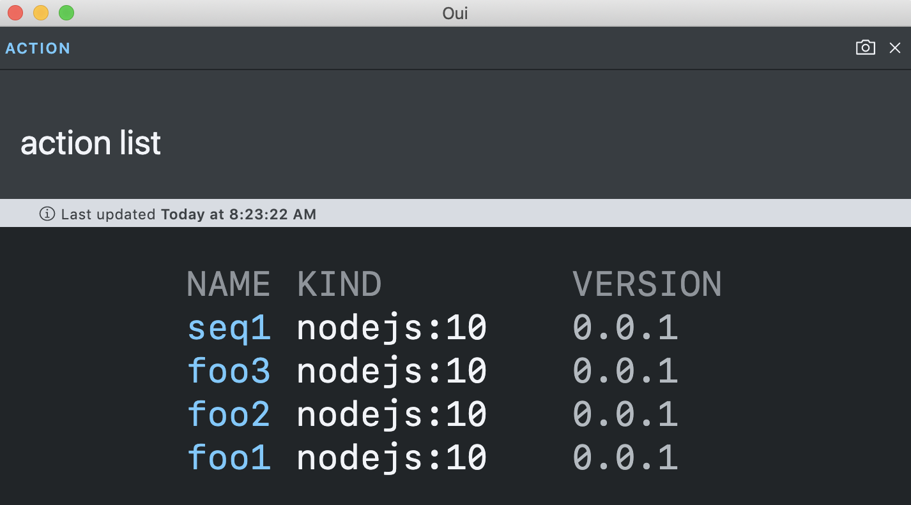
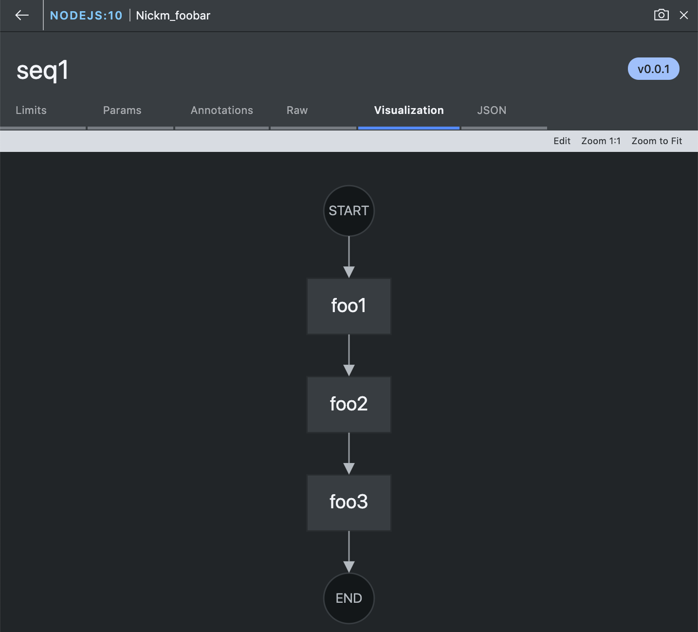

# A Visual Terminal for OpenWhisk

[](https://travis-ci.org/kui-shell/oui)
[](https://opensource.org/licenses/Apache-2.0)

This project offers a platform-native client that offers graphical
popups in response to normal OpenWhisk commands. To provide a
popup-from-terminal experience, this project leverages the
[Kui](https://github.com/IBM/kui) project.

For example, `oui action list` will pop up a window that displays a
table with clickable pod names; the screenshot to the right
illustrates one such popup. 

Upon clicking a resource name in a table, you will be presented with a
multi-tab view of the detail of the resource you selected; the
screenshot a bit further down and on the left illustrates such a
[multi-tab detail view](docs/oui-flow.png) for an OpenWhisk sequence.

# Code and Contribute

```bash
git clone https://github.com/kui-shell/oui && cd oui
npm ci
npm start
```

You should see a window come up. You can now try, for example, `wsk action list`, and expect to see a table (assuming you have deployed
actions), with clickable cells, in response.



## Edit-debug Loop

This project is coded in [TypeScript](https://www.typescriptlang.org).
You may launch a TypeScript watcher via:

```
npm run watch
```

The edit-debug loop involves: edit and save a source change; wait for
the TypeScript compiler to recompile your source changes; finally, in
most cases a simple reload (via Ctrl+R, or Command+R on macOS) of the
development client suffices to integrate your changes into an
already-open window.

## Building a Distribution

To pack up a set of platform clients for subsequent distribution, you
may leverage several npm targets expressed in the
[package.json](package.json):

This command will build a macOS tarball, and place it in
`dist/electron/Oui-darwin-x64.tar.bz2`:

```sh
npm run build:electron:mac
```

# Theming

You have the option to customize the theming in several ways. Here are
some of the choices you can influence:

- client name
- client icon
- default theme
- available themes

These changes are captured in the `theme/` subdirectory. More details
coming soon. For now, browse the [theme.json](theme/theme.json) file.
